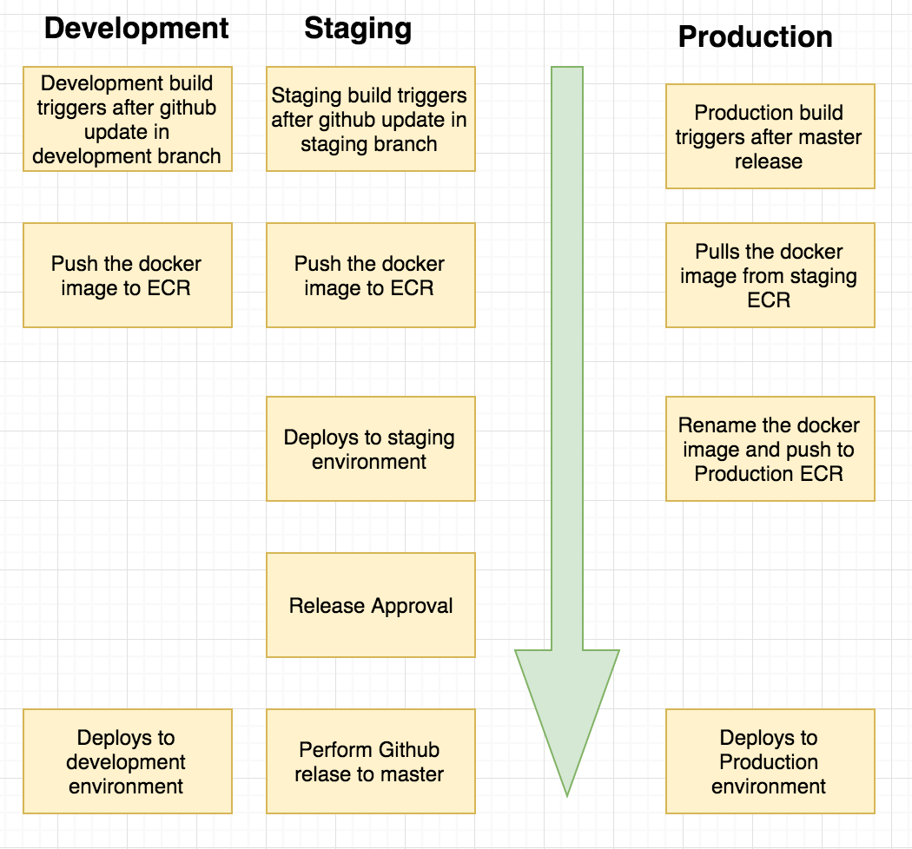

# IaC for Creating CodePipeline

## Prerequisites

### Create a reusable S3 buckets in the same region as your CodePipeline:

1. For your apps template (e.g. `ngp-v304-app-stage`) and store the Lambda function for slack notifications.

### Other steps

1. Your app repository must contain [buildspec.yaml](https://github.com/microservices-today/ngp-nodejs/blob/master/buildspec.yml) and [ecs.sh](https://github.com/microservices-today/ngp-nodejs/blob/master/ecs.sh) files (please refer to [ngp-nodejs](https://github.com/microservices-today/ngp-nodejs) app).
1. You should generate [GitHub Token](https://help.github.com/en/github/authenticating-to-github/creating-a-personal-access-token-for-the-command-line) with `admin:repo_hook` and `repo` scopes to enable github changes to trigger this pipeline.
1. (Optional) Notifications can be enabled by running [ngp-notification](https://github.com/microservices-today/ngp-notification.git)
 first and providing the SNS Topic ARN from the CloudFormation output as `SNSTopicARN` parameter value.

### Steps to install

1. Clone the repo
   ```bash
   git clone https://github.com/microservices-today/ecs-cicd.git`
   cd ecs-cicd
   ```
1. Export AWS credentials
   ```bash
   export AWS_ACCESS_KEY_ID="accesskey"
   export AWS_SECRET_ACCESS_KEY="secretkey"
   export AWS_DEFAULT_REGION="ap-southeast-1"
   ```
1. Run
   ```bash
   bash bin/configure.sh
   ```
1. Open the link at the end of the script to continue the installation.

### CodePipeline Stages

#### Source Stage

AWS CodePipeline uses GitHub repository as the source stage for your code.

#### Build Stage

For Development and Staging CodePipeline, CodeBuild builds docker image from the
source code and pushes it to ECR.
For Production environment, CodeBuild pulls docker image from the
Staging ECR and pushes it to Production ECR.

Also, CodeBuild updates the CloudFormation template (service.yaml) to deploy the ECS
Service with environment specific information.

#### Deploy Stage

AWS CloudFormation creates/updates the CloudFormation stack to create/update the
application Service in ECS.

### App specific environment variables

```bash
aws ssm put-parameter --name /v301-Dev/XXX --value "XXX" --type SecureString
aws ssm put-parameter --name /v304-Dev/YYY --value "YYY" --type SecureString
aws ssm put-parameter --name /v304-Dev/ZZZ --value "ZZZ" --type SecureString
```

Place your parameters keys (only keys, not actual secrets) in `.env.sample`
(please refer to [ngp-nodejs](https://github.com/microservices-today/ngp-nodejs) app):
```bash
➜  ngp-nodejs git:(master) ✗ cat .env.sample
XXX=
ZZZ=
YYY=
```

### Architecture


### Cross Account Deployment with Automated Release

The `ecs-cicd` can be configured to run staging and production pipeline in different accounts.
Using this workflow, release can be triggered from the Staging pipeline and Production
pipeline with pull the ECR image from Staging AWS Account.



### Environments are based on git workflow


