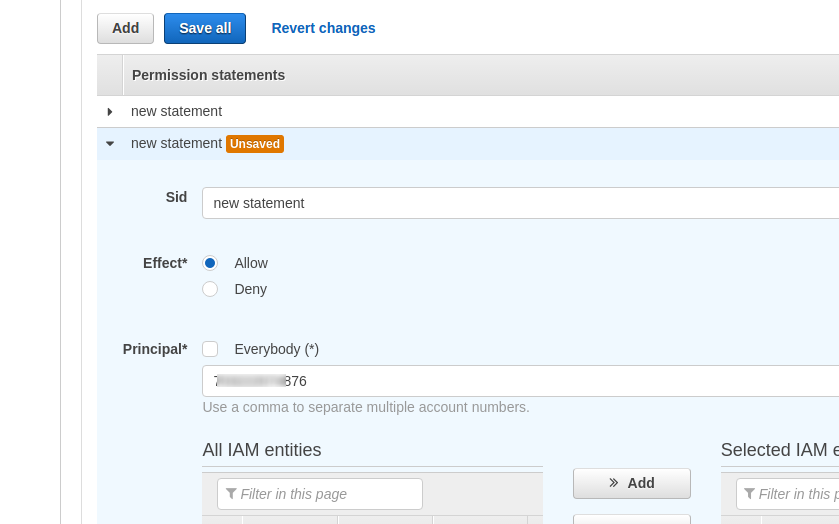
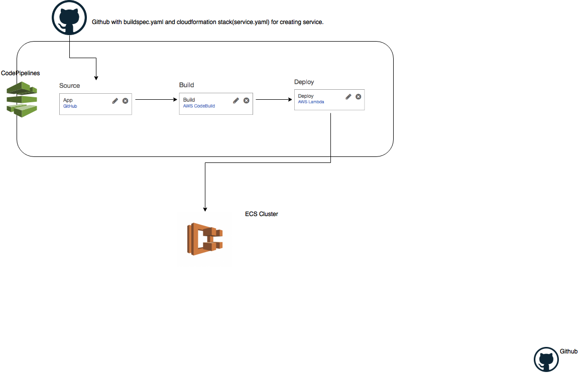

# IaC for Creating CodePipeline

### Prerequisites
1. Create an s3bucket to store the lamda function. The bucket should be in same region as your codepipeline.
2. Create an ECR repository in the region containing the ECS CLUSTER.
3. The application repository must contain `ecs/service.yaml` and `buildspec.yaml`.
4. GitHub Token with `admin:repo_hook` and `repo` scopes.

### Steps to install.
1. Update `lambda/config.json` file.
    - `codepipeline_region`: Region in which codepipeline is running. Some region may not have code build or code deploy,
     in that case we have to use different region for running pipeline than ecs cluster region.
    - `ecs_cluster_region`: Region in which ECS cluster is running
2. Run `bash bin/configure.sh`.
3. Open the link and at the end of the script to continue the installation.
4. Sample parameters can be seen in `parameters.json`

### ! Important
In order to pull staging images to production account we need to assign production account permissions to staging ECR.
1. All repositories > repository-name > Permissions tab
2. Add a new repository policy. Give production account Id to Principal input field.
3. Select Action as *All actions*
4. Save the policy.

### Architecture

### CodePipeline Stages
##### Source Stage
AWS CodePipeline uses GitHub repository as the source stage for your code.

##### Build Stage
For Development and Staging CodePipeline, CodeBuild builds docker image from the 
source code and pushes it to ECR.
For production environment, CodeBuild pulls docker image from the
Staging ECR and pushes it to Production ECR.

Also, CodeBuild updates the CloudFormation template (service.yaml) to deploy the ECS
Service with environment specific information.

##### Deploy Stage
AWS Lambda creates/updates the CloudFormation stack to create/update the 
application Service in ECS.
