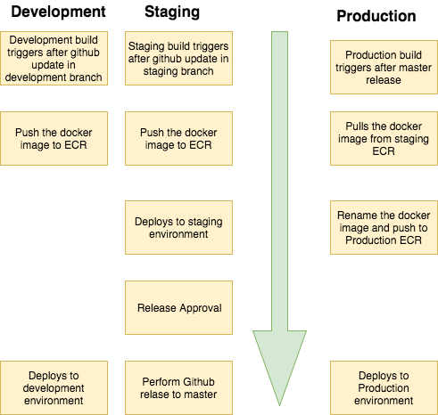

# IaC for Creating CodePipeline

### Prerequisites
##### Create an two S3 buckets in same region as your codepipeline (Once!):
1. For your apps template (e.g. `ngp-app-v204`) and store the Lambda function for slack notifications.  
2. For your apps env variables (e.g. `ngp-app-v204-env`). [App specific environment variables](https://github.com/microservices-today/ngp-app-codepipeline#app-specific-environment-variables) 
section explains on how environment variables needs to be added to the S3 Bucket.
##### Other steps
1. Create an ECS repository in the same region as your ECS Cluster (e.g. `microservice/ngp-node-server`)
2. Your app repository must contain `ecs/service.yaml` and `buildspec.yaml`.
3. GitHub Token with `admin:repo_hook` and `repo` scopes.
4. (Optional) Notifications can be enabled by running [ngp-notification](https://github.com/microservices-today/ngp-notification.git)
 first and providing the SNS Topic ARN from the CloudFormation output as `SNSTopicARN` parameter value.

### Steps to install.
1. Clone the repo  
   `git clone https://github.com/microservices-today/ngp-app-codepipeline.git`  
   `cd ngp-app-codepipeline`
2. Export AWS credentials     
   `export AWS_ACCESS_KEY_ID="accesskey"`   
   `export AWS_SECRET_ACCESS_KEY="secretkey"`     
   `export AWS_DEFAULT_REGION="ap-northeast-1"`   
3. Run `bash bin/configure.sh`.
4. Open the link at the end of the script to continue the installation.

### ! Important
In order to pull staging images to production account we need to assign production account permissions to staging ECR.
1. All repositories > repository-name > Permissions tab
2. Add a new repository policy. Give production account Id to Principal input field.
3. Select Action as *All actions*
4. Save the policy.


### Architecture


### CodePipeline Stages
##### Source Stage
AWS CodePipeline uses GitHub repository as the source stage for your code.

##### Build Stage
For Development and Staging CodePipeline, CodeBuild builds docker image from the 
source code and pushes it to ECR.
For production environment, CodeBuild pulls docker image from the
Staging ECR and pushes it to Production ECR.

Also, CodeBuild updates the CloudFormation template (service.yaml) to deploy the ECS
Service with environment specific information.

##### Deploy Stage
AWS CloudFormation creates/updates the CloudFormation stack to create/update the 
application Service in ECS.


### App specific environment variables
App specific environment variables can be passed to CodePipeline by specifying the S3 Bucket and filename which contains the environment variables.
- First line should be a newline
- Variables should be in key value format
- Keep the tab spaces same as example file
Eg:
```

        Environment:
        - Name: NODE_ENV
          Value: 6.0
```

(Example file)[./code_build_env.yaml]
### Cross Account Deployment with Automated Release
The `ngp-app-codepipeline` can be configured to run staging and production pipeline in different accounts.
Using this workflow, release can be triggered from the Staging pipeline and Production 
pipeline with pull the ECR image from Staging AWS Account.

